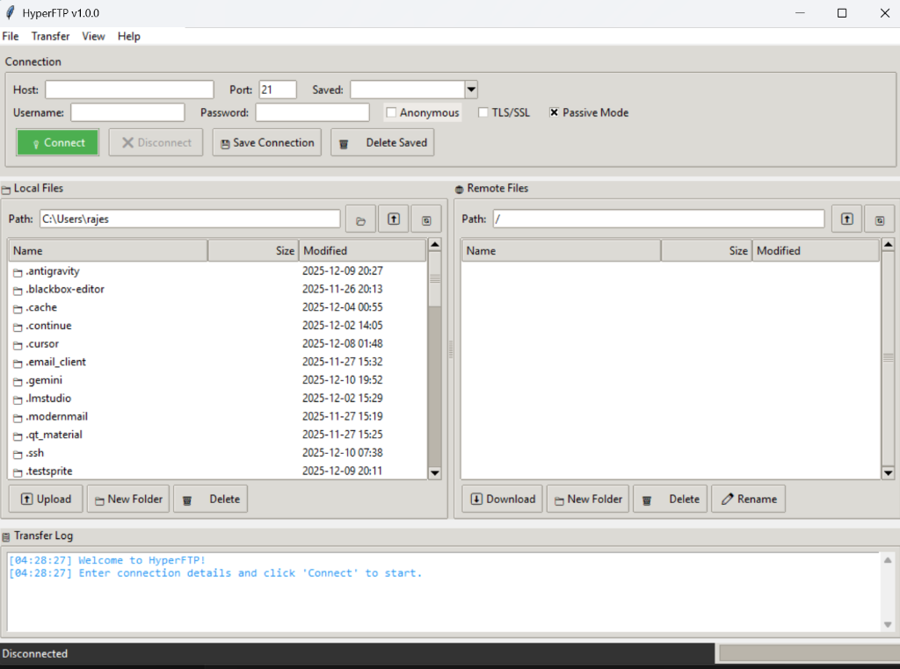

# HyperFTP v1.0.0

<p align="center">
  <strong>🚀 A Professional FTP Client Built with Python</strong>
</p>

<p align="center">
  
  
  
  
</p>

<p align="center">
  <em>A modern, feature-rich FTP client with dual-pane file browsing, secure FTPS support, and connection management</em>
</p>

---

## 📸 Application Screenshot

<p align="center">
  
</p>

<p align="center">
  <em>HyperFTP v1.0.0 - Modern dual-pane interface with local and remote file browsing, connection management, and real-time transfer logging</em>
</p>

---

## ✨ Features

### 🔒 Security & Connection
- **FTP & FTPS Support** - Secure connections with TLS/SSL encryption
- **Anonymous Login** - Quick access to public FTP servers
- **Passive/Active Modes** - Flexible connection handling for different network configurations

### 📂 File Management
- **Dual-Pane Browser** - Navigate local and remote files side-by-side
- **File Operations** - Upload, download, rename, and delete files/folders
- **Folder Creation** - Create new directories on both local and remote systems
- **Context Menu** - Right-click for quick access to common operations

### 💾 Connection Management
- **Save Connections** - Store frequently used FTP server credentials
- **Quick Connect** - Load saved connections from dropdown menu
- **Delete Saved** - Remove unwanted saved connections

### 📊 Monitoring & Feedback
- **Transfer Log** - Real-time logging of all FTP operations
- **Progress Tracking** - Monitor file transfer status
- **Status Bar** - Connection state indicator at bottom of window

### ⌨️ Productivity
- **Keyboard Shortcuts** - Efficient navigation with hotkeys
- **Path Navigation** - Direct path input for quick access
- **Refresh Controls** - Quickly refresh local or remote file listings

---

## 🚀 Quick Start

### Option 1: Windows Executable (Recommended)

Download the standalone executable - **no Python installation required**:

1. Go to [Releases](https://github.com/rajeshsharma-sec/HyperFTP-v1.0/releases)
2. Download `HyperFTP.exe`
3. Double-click to run

### Option 2: Run from Source

#### Prerequisites

- Python 3.8 or higher
- tkinter (usually included with Python)

#### Installation

```bash
# Clone the repository
git clone https://github.com/rajeshsharma-sec/HyperFTP-v1.0.git

# Navigate to the directory
cd HyperFTP-v1.0

# Run the application
python HyperFTP.py
```

### Option 3: Build Executable Yourself

```bash
# Install PyInstaller
pip install pyinstaller

# Build the executable
pyinstaller --onefile --windowed --name "HyperFTP" HyperFTP.py

# Find the executable in dist/ folder
```

---

## 📖 How to Use

### 1. Connect to an FTP Server

| Field | Description |
|-------|-------------|
| **Host** | FTP server address (e.g., `ftp.example.com`) |
| **Port** | Usually `21` for FTP, `990` for FTPS |
| **Username** | Your FTP username |
| **Password** | Your FTP password |
| **Anonymous** | Check for anonymous login (no credentials needed) |
| **TLS/SSL** | Enable secure FTPS connection |
| **Passive Mode** | Recommended for most firewall configurations |

### 2. Transfer Files

- **Navigate**: Double-click folders to open them
- **Upload**: Select local files → Click **Upload** button
- **Download**: Select remote files → Click **Download** button
- **Delete**: Select files → Click **Delete** button
- **New Folder**: Create directories on local or remote systems
- **Rename**: Rename files on remote server (right-click menu)

### 3. Keyboard Shortcuts

| Shortcut | Action |
|----------|--------|
| `Ctrl+N` | New Connection |
| `Ctrl+U` | Upload Selected |
| `Ctrl+D` | Download Selected |
| `F5` | Refresh Local Files |
| `F6` | Refresh Remote Files |

### 4. Save Connections

- Enter connection details and click **Save Connection**
- Select from **Saved** dropdown to quickly load saved servers
- Use **Delete Saved** to remove unwanted connections

---

## 🛠️ Technical Details

| Component | Technology |
|-----------|------------|
| **GUI Framework** | Tkinter with ttk styling |
| **FTP Library** | Python's built-in `ftplib` |
| **Threading** | Non-blocking file transfers |
| **Config Storage** | JSON-based connection profiles |
| **Language** | Python 3.8+ |

### Architecture
- **Single-file application** - All code in `HyperFTP.py`
- **Cross-platform** - Works on Windows, Linux, and macOS
- **No external dependencies** - Uses only Python standard library

---

## 📁 Project Structure

```
HyperFTP-v1.0/
├── HyperFTP.py              # Main application source code
├── README.md                # Project documentation
├── screenshots/             # Application screenshots
│   └── hyperftp_main.png    # Main interface screenshot
├── dist/
│   └── HyperFTP.exe         # Windows executable
├── .github/
│   └── workflows/           # GitHub Actions for automated builds
└── hyperftp_config.json     # Saved connections (auto-generated)
```

---

## � Troubleshooting

| Issue | Solution |
|-------|----------|
| **Connection refused** | Verify host and port are correct |
| **Login failed** | Check username/password or try anonymous |
| **Timeout errors** | Try enabling Passive Mode |
| **SSL errors** | Server may not support FTPS |
| **Permission denied** | Check file/folder permissions on server |

---

## �📄 License

This project is licensed under the MIT License - see the [LICENSE](LICENSE) file for details.

---

## 👤 Author

<p align="center">
  <strong>rajeshsharma-sec</strong>
</p>

<p align="center">
  <a href="https://github.com/rajeshsharma-sec">
    
  </a>
</p>

---

<p align="center">
  <strong>⭐ Star this repository if you find it useful! ⭐</strong>
</p>

<p align="center">
  Made with ❤️ by rajeshsharma-sec
</p>
